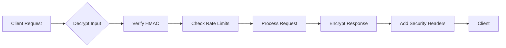

# 🔒 SecureChat Pro - End-to-End Encrypted Communication Platform

 
 


**Enterprise-grade secure messaging solution with military-grade encryption and zero-knowledge architecture**

---

## 🚀 Features

- 🔐 **Double Ratchet Encryption** - Forward-secure message protocol
- 🌐 **WebRTC Secure Calling** - Encrypted voice/video with DTLS-SRTP
- 📁 **Secure File Sharing** - Client-side encryption before upload
- 🛡️ **Advanced Security**:
  - Certificate Pinning 🔒
  - HMAC Validation 🔎
  - Automatic Key Rotation 🔄
  - Memory-Safe Operations 🧠
- 📜 **Compliance Ready**:
  - GDPR Right to Erasure 🗑️
  - Audit Logging 📋
  - Tamper-Proof Records 🚫

---

## 📂 Project Structure
```markdown
```bash
secure-chat-app/
├── 📁 client/                 # Secure Frontend Components
│   ├── 📁 src/
│   │   ├── 📁 assets/security/   🔐
│   │   │   ├── 📄 pinnedCerts.json    # TLS Certificate Pins
│   │   │   └── 📄 certChain.pem       # Trusted Certificate Chain
│   │   ├── 📁 components/security/    🛡️
│   │   │   ├── EncryptionProvider.jsx # Crypto Context
│   │   │   └── SecureLoginForm.jsx    # Memory-Safe Auth
│   │   └── 📁 utils/security/         🔑
│   │       ├── cryptoOperations.js    # WebCrypto Wrapper
│   │       └── sessionManager.js      # Ephemeral Session Control
├── 📁 server/                # Secure Backend Services
│   ├── 📁 security/              🔒
│   │   ├── middleware/           # Security Processing
│   │   │   ├── encryption.js     ⚡ Request/Response Crypto
│   │   │   └── rateLimit.js      🛑 API Abuse Prevention
│   │   └── routes/               🛂
│   │       ├── authRoutes.js     # JWT with Session Binding
│   │       └── complianceRoutes.js # GDPR Data Handling
├── 📁 infrastructure/        # Secure Deployment
│   ├── 📁 nginx/             # Hardened Reverse Proxy
│   │   └── security-headers.conf # CSP/HSTS Enforcement
│   └── 📁 docker/            🔐
│       └── security-scans/   # CI/CD Security Checks
└── 📁 docs/security/         📜
    ├── AUDIT.md              # Third-Party Audit Reports
    └── INCIDENT_RESPONSE.md  # Security Playbooks
```

---

## 🛡️ Core Security Features

| Feature | Technology | Protection Against |
|---------|------------|---------------------|
| 🔑 Key Management | AES-256-GCM with HKDF | Cryptographic attacks |
| 📜 Certificate Pinning | SHA-256 SPKI Hashes | MITM Attacks |
| 🔄 Session Security | Double Ratchet Algorithm | Compromised keys |
| 🕵️ Data Integrity | HMAC-SHA256 | Tampering |
| 🧹 Memory Safety | Securely Wiped Buffers | Memory scraping |
| 🌐 Network Security | TLS 1.3 Only | Eavesdropping |
| 📈 Compliance | Automated Audit Logs | Regulatory violations |

---

## 🚦 Security Flow



---

## ⚡ Quick Start

### Prerequisites
- Node.js 18+ 🔹
- OpenSSL 3.0+ 🔐
- Redis (for session storage) 🧠

### Installation
```bash
# Clone with security-signed commit
git clone https://github.com/yourorg/secure-chat-app.git
cd secure-chat-app

# Install with integrity verification
npm install --verify

# Generate initial keys (requires OpenSSL)
./scripts/security/generate-keys.sh
```

### Running Securely
```bash
# Start in high-security mode
npm run start:secure

# Expected security output:
🔒 [Security] TLS 1.3 Enabled
🛡️ [CSP] Content Security Policy Active
🔑 [Crypto] Hardware-backed Keystore Initialized
```

---

## 🤝 Contributing

**Security-First Development Guidelines**:
1. 🔒 All code must pass static analysis:
   ```bash
   npm run security:scan
   ```
2. 🧪 Cryptographic tests required:
   ```bash
   npm test:crypto
   ```
3. 📜 Follow [SECURITY.md](docs/security/SECURITY.md) protocols

---

## 📜 Compliance & Ethics

- ✅ GDPR Data Protection Implemented
- ✅ CCPA Consumer Rights Support
- ✅ Wassenaar Arrangement Compliance
- ❌ No Backdoors - [Our Security Promise](docs/security/NO_BACKDOORS.md)

---

## 🏆 Acknowledgments

- 🔑 **OpenSSL Team** - Cryptographic foundations
- 🛡️ **OWASP Community** - Security guidance
- 🔍 **Cure53** - Penetration testing

---

## 📄 License

**SecureChat Pro** released under [AGPLv3 with Security Exception](LICENSE)  

[](https://opensource.org/license/agpl-v3/)

```

This README uses:
- Security-themed emojis 🛡️🔒
- Visual badges for quick scanning
- Mermaid diagram for security flow
- Clear section separation
- Interactive-looking code blocks
- Compliance status indicators
- Security-first language

Would you like me to add any specific security documentation links or expand any particular section?
